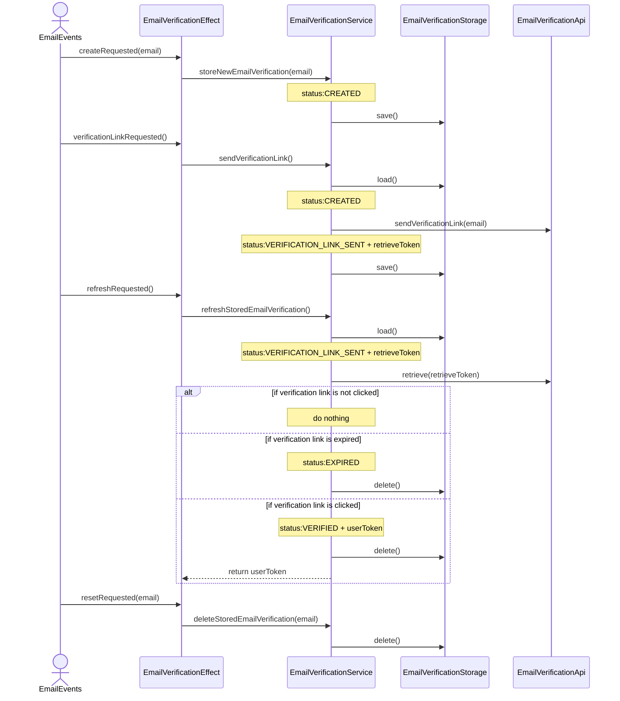
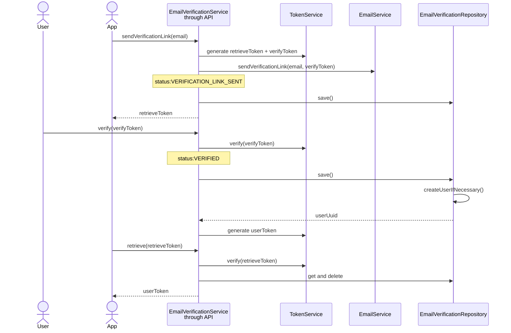

User requests to create an account with an email address. The system creates an account with status PENDING_VERIFICATION, and requests the verification of the email address.

The email verification process is create locally, then if online, the verification link is sent to the user.
The status of the email verification checked on a loop every 60 seconds.
When verified, the user token is returned to the account.
If verification expires before the user clicks the verification link, the email verification is deleted.

EmailVerificationService synchronizes the local storage with the backend.

On the backend, the email verification service handles the verification link sending and verification.

